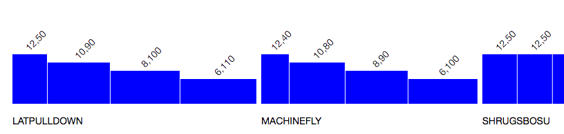

# Trackercize
Web application that allows users to track their workouts with nice visualizations

## Technologies Used
* Back-end: Python, Flask, PostgreSQL, alembic
* Front-end: Angular2, TypeScript, D3, Webpack

The width of each bar represents the weight used and the height represents the number of reps.
